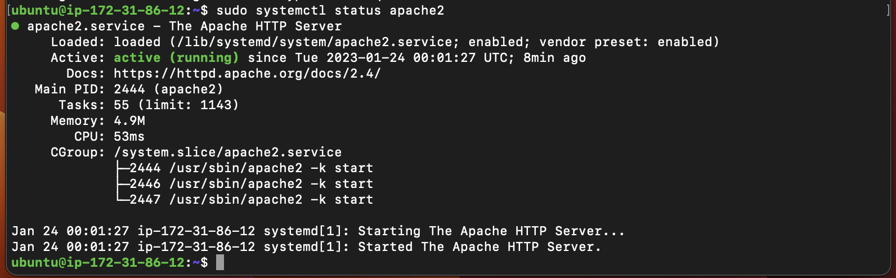
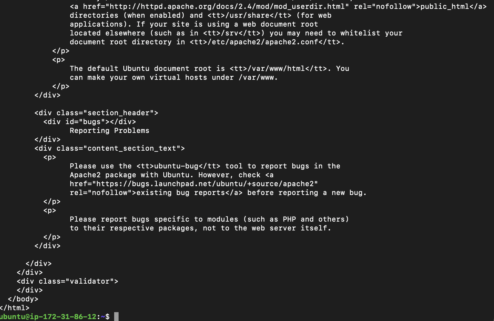
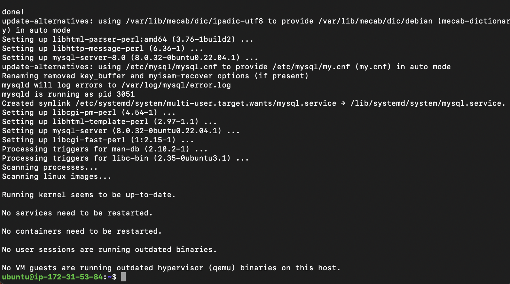
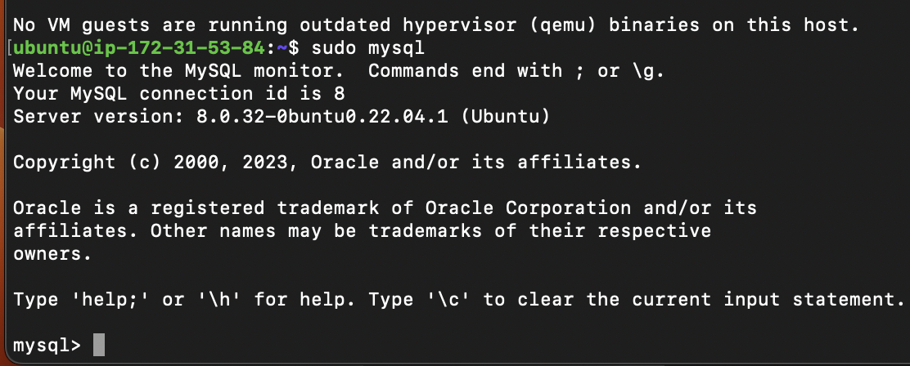
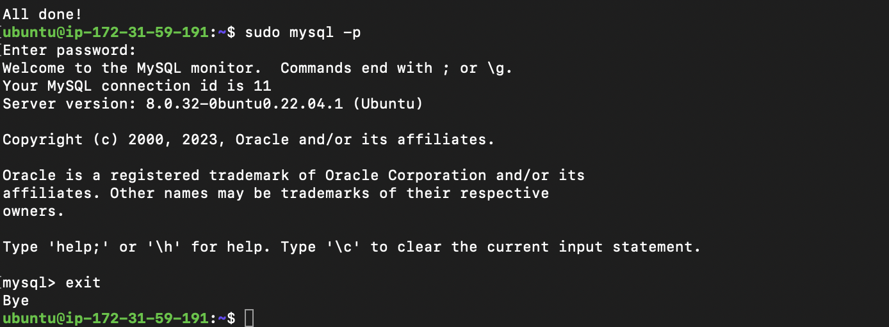
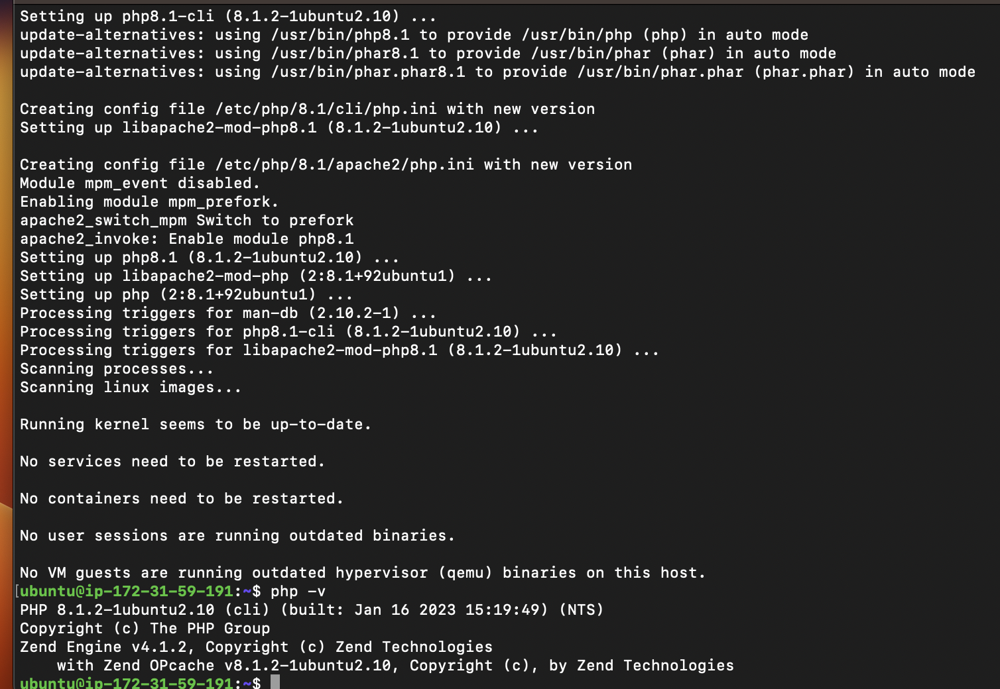
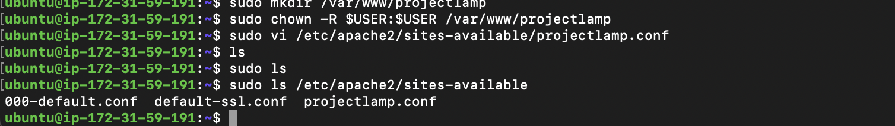
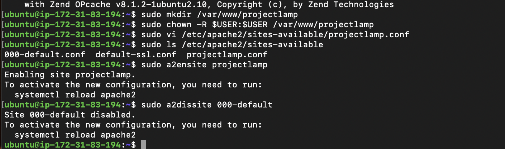

## Documentation of project1

# update a list of packages in package manager
'sudo apt update'

# apache2 package installation
'sudo apt install apache2'

# apache2 verification status
'sudo systemctl status apache2'

# Try to check if we can access it locally in our Ubuntu shell
'curl http://localhost:80'

# installing mysql
'sudo apt install mysql-server'

# login to mysql
'sudo mysql'

# installing mysql secure installation
'sudo mysql_secure_installation'

# test login mysql output
'sudo mysql -p'

# installing php
'sudo apt install php libapache2-mod-php php-mysql'

# domain setup called projectlamp
'sudo mkdir /var/www/projectlamp' 
'sudo chown -R $USER:$USER /var/www/projectlamp'
'sudo vi /etc/apache2/sites-available/projectlamp.conf'
'<VirtualHost *:80>
    ServerName projectlamp
    ServerAlias www.projectlamp 
    ServerAdmin webmaster@localhost
    DocumentRoot /var/www/projectlamp
    ErrorLog ${APACHE_LOG_DIR}/error.log
    CustomLog ${APACHE_LOG_DIR}/access.log combined
</VirtualHost>'
'Hit the esc button on the keyboard
Type :
Type wq. w for write and q for quit
Hit ENTER to save the file'

# To show the new file in site available
'sudo ls /etc/apache2/sites-available'

# To enable the new virtual host
'sudo a2ensite projectlamp'
# To enable the new virtual host
'sudo a2dissite 000-default'

# To prevent syntax error
'sudo apache2ctl configtest'
'sudo systemctl reload apache2'

# Created a file named index.php
'vim /var/www/projectlamp/index.php'
'<?php'
'phpinfo();'
[php file output](./images/php file output.png)

